# ilorest issue

update ilorest to 3.3\
virtual media can pass on linux\
**ilo account**\
No issue on remote login\
add account can pass with interactive mode

local login error: ERROR: 'Oem'. Not always shown\
Once this error occur, following command will always show ERROR: 'Oem' and failed
[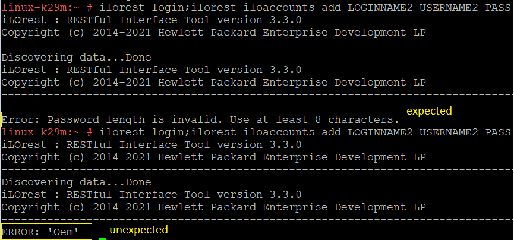](image/linux-local-login-error.png)

## ilorest issue2

Execute ilo account test cases on remote login continuously.
[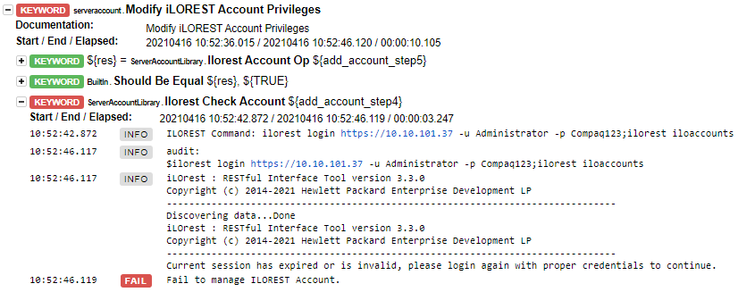](image/fail-to-manage-ilo-account.png)

# Virtual Media
|Test case ID | test case|
|------------|-----------|
| 3516952| iLOrest 3x Virtual Media RHEL83 Remote| 
| 3516931| iLOrest 3x Virtual Media W2K19 Local|
| 3516886| iLOrest 3x Virtual Media SLES12 SP5 Local|
| 3516907| iLOrest 3x Virtual Media W2K16 Remote| 

RHEL 83
--------
command for me: 
`robot -L trace:info -d reports/ -V variables/virtualmedia.yaml --include 3516952 suites`
command for mat:
`robot -L trace:info -d reports-3516952 -V variables/virtualmedia.yaml --include 3516952 suites`

W2k19
-----
command for me:
`robot -L trace:info -d reports/ -V variables/virtualmedia.yaml --include 3516931 suites`
command for mat:
`robot -L trace:info -d reports-3516931 -V variables/virtualmedia.yaml --include 3516931 suites`

S12SP5
-----
command for me:
`robot -L trace:info -d reports/ -V variables/virtualmedia.yaml --include 3516886 suites`
command for mat:
`robot -L trace:info -d reports-3516886 -V variables/virtualmedia.yaml --include 3516886 suites`

W2k16
-----
command for me:
`robot -L trace:info -d reports/ -V variables/virtualmedia.yaml --include 3516907 suites`
command for mat:
`robot -L trace:info -d reports-3516907 -V variables/virtualmedia.yaml --include 3516907 suites`

linux ilorest version: ilorest-3.3.0-4.x86_64.rpm\
w2k16 : 10.10.41.42 ilorest-3.3.0-3.x86_64\
w2k19 : 10.10.41.5

| Type | Test item | Current Message |Test Result - linux| Test reuslts - windows | 
| ---- | ------- | ------ | -------------- | ----|
| RAT |3516952| pass | pass|
| FET | *Verify Virtual Media* with no media inserted | [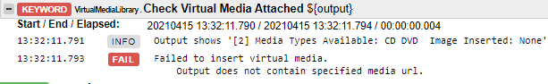](image/no-virtual-meida.png) | pass| pass|
| FET | Remove Media failure or found media attached in the begining| [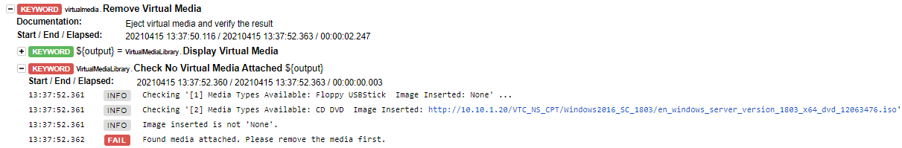](image/remove-virtual-media-fail.png) | pass | pass | 
| FET | Remove media with no media attached | [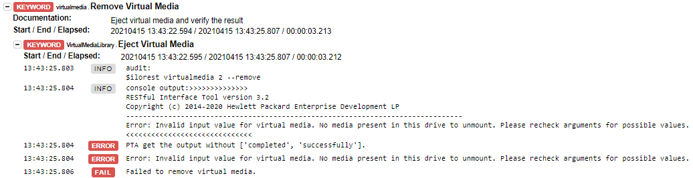](image/remove-media-failure.png) | pass| [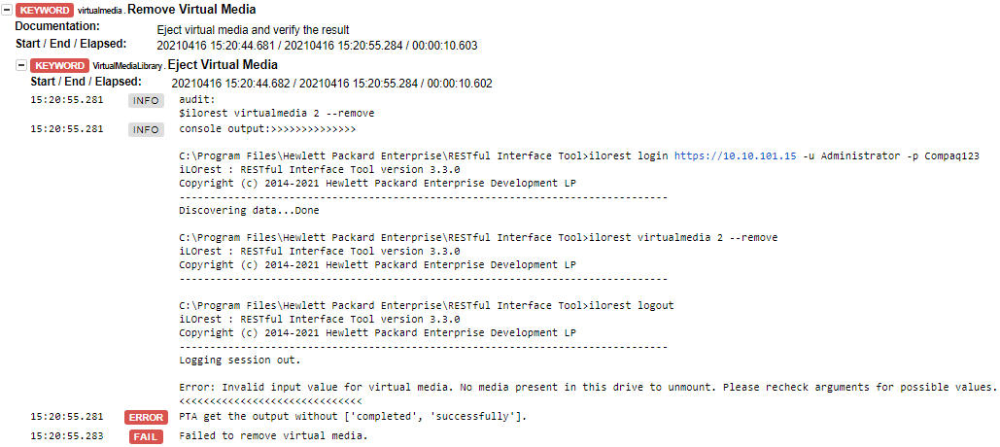](image/windows-remove-media-with-no-media-attached.png)|
| FET | Force to insert media with media attached | [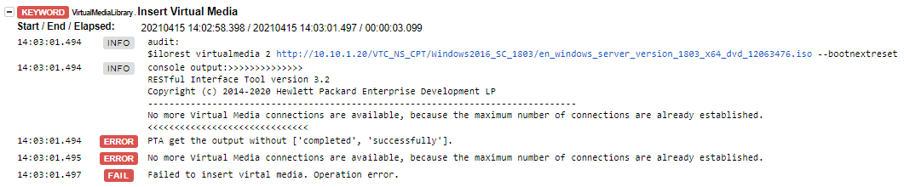](image/force-insert-media-with-media-attached.png) | pass| [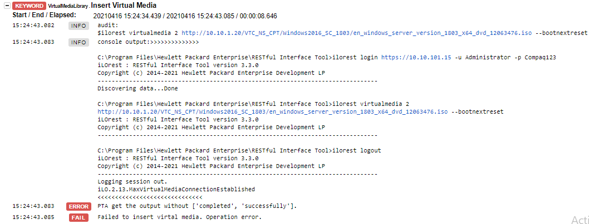](image/windows-force-to-insert-media-with-media-attached.png)|
| FET | iLo with no license activation key |[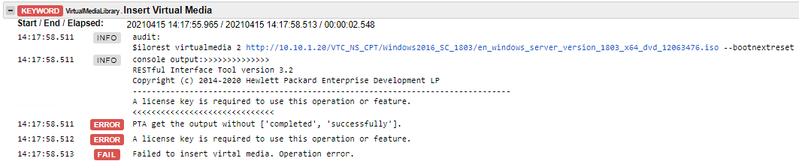](image/no-license-key.png) | pass|
| FET | invalid media URL | [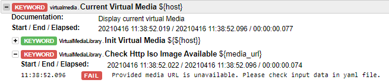](image/invalid-media-url.png) | pass| pass| 
| FET | invaild http server | [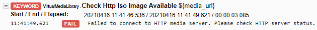](image/invalid-http-server.png) | pass| pass|
| FET | invalid iso for example pdf | job can pass | fail, feature not ready |
| RAT | 3516886 | pass | pass|
| RAT | 3516907 | pass | pass|
| RAT | 3516931 | pass | pass|

# iLo account

|Test case ID | test case|
|------------|-----------|
| 3516908| iLOrest iLO Accounts  W2K16 Remote| 
| 3516932| iLOrest iLO Accounts  W2K19 Local|
| 3516953| iLOrest iLO Accounts  RHEL83 Remote|
| 3516887| iLOrest iLO Accounts  SLES12 SP5 Local|

RHEL83
--------
robot -L trace:info -d reports/ -V variables/serveraccount.yaml --include 3516953 suites
continuous execute 6 times

*Verify on both windows and linux*

| Type | Test item | Current Message |Expected Result|
| ---- | ------- | ------ | -------------- |
| FET(fail) | login with credentials which doesn't exist | [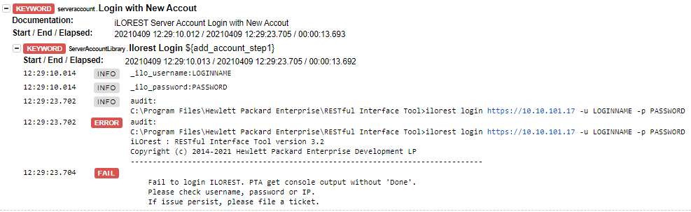](image/login-eror.png) |PTA should return the error message [Error: Could not authenticate. Invalid credentials, or bad username/password.]|
| FET(pass) | iLo account or login name is already in use. | [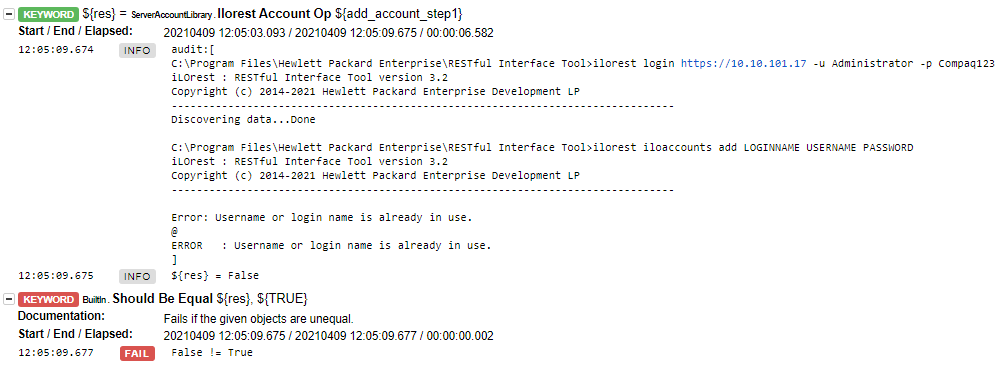](image/account-exist.png) | Sugestion: Return message "please remove XXX account first and execute again"|
| FET(pass) | Keyword "iLorest Check account" for account doesn't exist | [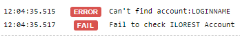](image/cannot-find-account.png) | |
| FET(fail) | delete the account which doesn't exist|[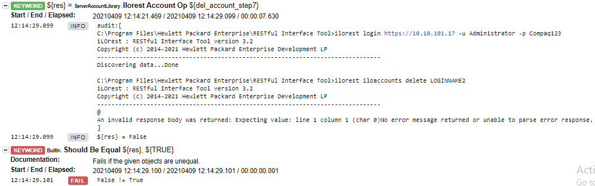](image/delete-account-fail.png) | 1. Specify which account doesn't exist. 2.remove second info, cause it's the same

> **_NOTE0:_** remain only ilorest command or audit.

> **_Clrity:_** If PTA get console output contain following error words: [error,failed,is not recognized,exist, invalid], ilorest account addition failed.
[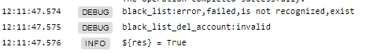](image/black-list.png)

w2k16
----------
robot -L trace:info -d reports-3516908  -V variables/serveraccount.yaml --include 3516908 suites 

| Type | Test item | Current Message |Expected Result|
| ---- | ------- | ------ | -------------- |
| FET | iLo account or login name is already in use. | ERROR : Username or login name is already in use. False != True > **will add in user guide.** | Specify which account already exist, and show "please remove XXX account first and execute again" |
| FET | Keyword "iLorest Check account" for account doesn't exist |Can't find account:LOGINNAME. Fail to check ILOREST Account| |
| FET | login with credentials which doesn't exist | PTA only show "Fail to login ILOREST. PTA get console output without 'Done'.Please try again or file a ticket." > **Please check username, password or IP.If issue persist, please file a ticket.**  | PTA should show the error message: Validating............. Error: Could not authenticate. Invalid credentials, or bad username/password.|
| FET | delete the account which doesn't exist| An invalid response body was returned: Expecting value: line 1 column 1 (char 0)No error message returned or unable to parse error response.**please check .yaml file...** | 1. Specify which account doesn't exist. 2.remove second info, cause it's the same

> **_NOTE0:_** modify step: ... to check account:?

> **_NOTE1:_** what is the purpose of keyword "Add iLOREST New Account2" (ilorest iloaccounts add LOGINNAME2 USERNAME2 PASSWORD)? > **change to fix invalid password**

> **_NOTE2:_** why we need serveraccount.Login before Logout?  > test case requirement

> **_NOTE3:_** Logs black list for "ilorest_verify_account_cmd_exec in debug mode" > fix

[keyword](repository_command.md)