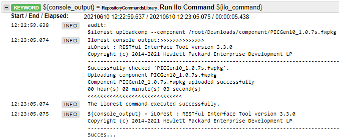
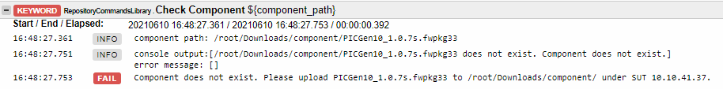
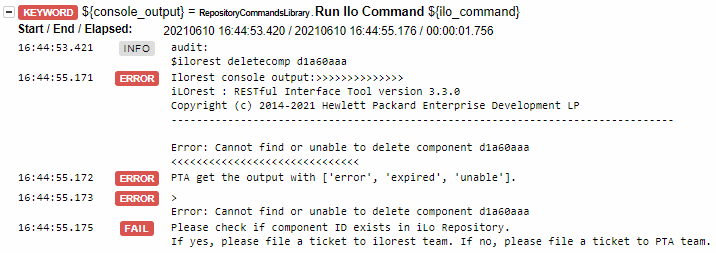
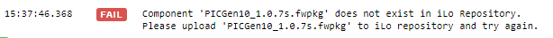
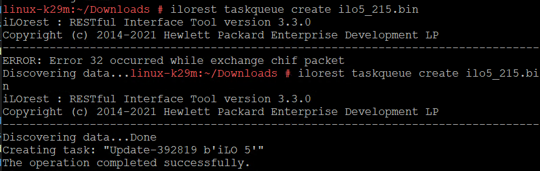
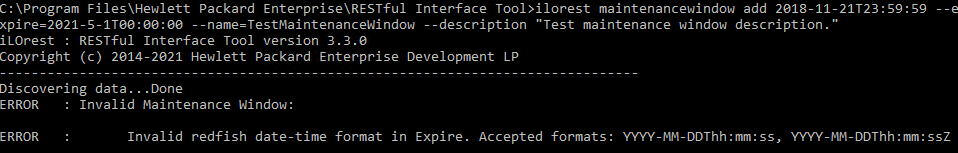
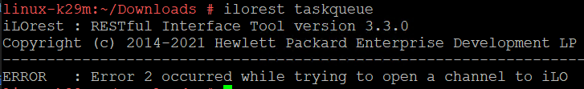
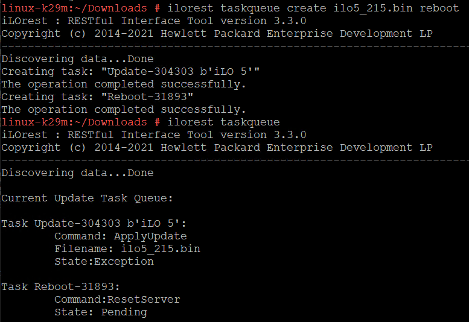
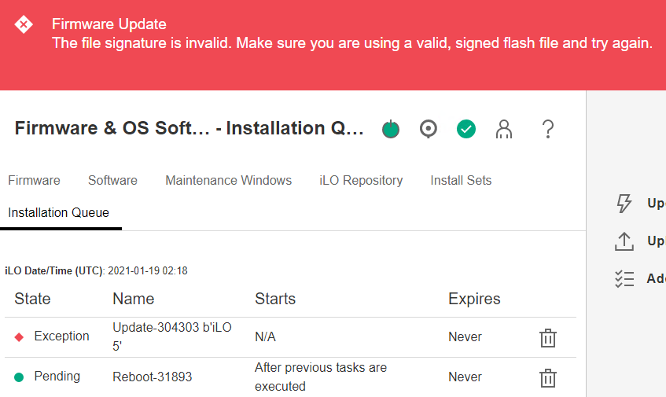

linux ilorest version: ilorest-3.3.0-4.x86_64.rpm\

| Type | Test item | Current Message |Test Result - linux| Test reuslts - windows | 
| ---- | ------- | ------ | -------------- | ----|
| RAT | ilorest command pass |  | |
| FET | no component in SUT |  | |
| FET | delete component failure |  | |
| FET | Extract component id failure |  | |

3. Upload and Verify Repository Contents
    * ${component_name} =  **Check Component**  ${component_path}
    * ${listcomp_content} =  Get Ilorest Info  ${listcomp_cmd}
        * ${console_output} =  **Run ILO Command**   ${ilo_command}
        * Log to console  ${console_output1
    * Run Keywrd If  ${component_name} in ${listcomp_content}\
    ...  ${comp_id} =  Get Component ID  ${component_name}\
    ...  Verify Ilorest Command  ${[${deletecomp_cmd}, ' ', ${comp_id}]}  successfully
        * ${listcomp_content} =  Get Ilorest Info  ${listcomp_cmd}
        * ${comp_id} =  **Extract component ID**  ${listcomp_content}  ${component}\
        * ${console_output} =  **Run ILO Command**   ${ilo_command}
        * Should Contain  ${console_output}  ${white_list}

    * Verify Ilorest Command  *${[${uploadcomp_cmd}, ' ', ${component_path}]}*  uploaded successfully
    * Verify Ilorest Command  ${listcomp_cmd}  ${component_name}

    - (Q) Prepare package
        1. PTA provide component in robot
        2. User transfer component to robot
        3. (V) User prepare component to SUT

    ---
    > **_NOTE:_**  Raise error if filename contains "unsigned"
    > **_NOTE:_** Need to check the firware restriction.
    > **_CheckPoint_** PTA need to seperate issue caused by *free space*, *unsign bin* or *firmware restriction*.

    `ilorest listcomp`\
    `$ilorest uploadcomp --component ${path_filename} `\
    Occasionally issue:
    
4. Delete and Verify Repository Contents
    * ${comp1_id} =  Get Component ID  ${component1_name}
        * ${listcomp_content} =  Get Ilorest Info  ${listcomp}
        * ${comp_id} =  Extract component ID  ${listcomp_content}  ${component}
    * Verify Ilorest Command  ${[${deletecomp_cmd}, ' ', ${comp_id}]}  completed successfully
        * ${console_output} =  Run ILO Command   ${ilo_command}
        * Should Contain  ${console_output}  ${white_list}
    * Verify Ilorest Command Should Not Contain  ${listcomp_cmd}  ${comp1_id}

    `$ilorest deletecomp ${comp_id}`\
    `$ilorest listcomp`

5. Upload again
    * ${component1_name} =  Upload and Verify Repository Contents  ${component1_path}
    * **Upload Duplicated package to iLo repository**  ${component1_path}
    * Verify Ilorest Command  ${[${forceuploadcomp_cmd}, ' ', ${component1_path}  uploaded successfully
    * **Verify Only One Copy of The Component**  ${component1_name}

    `$ilorest uploadcomp --component ${path_filename} --forceupload `\
    `$ilorest listcomp`

6. Multiple Delete
    * ${component2_name} =  Upload and Verify Repository Contents  ${component2_path}
    * ${comp2_id} =  Get Component ID  ${component2_name}
    * ${component3_name} =  Upload and Verify Repository Contents  ${component3_path}
    * ${comp3_id} =  Get Component ID  ${component3_name}
    * Verify Ilorest Command  ${[${deletecomp_cmd}, ' ', ${comp1_id}, ' ',${comp2_id}, '${comp3_id}]}   completed successfully
    * Verify Ilorest Command Should Not Contain  ${listcomp_cmd}  ${comp1_id}
    * Verify Ilorest Command Should Not Contain  ${listcomp_cmd}  ${comp2_id}
    * Verify Ilorest Command Should Not Contain  ${listcomp_cmd}  ${comp3_id}

    `$ilorest uploadcomp --component ${path_filename} `\
    `ilorest deletecomp $comp_id.....`\
    `$ilorest listcomp`

7. Download Components
    * ${component1_name} =  Upload and Verify Repository Contents  ${component1_path}
    * ${listcomp_content} =  Get Ilorest Info  ${listcomp_cmd}
    * ${comp_uri} =  **Extract component URI**  ${listcomp_content}  ${component1_name}
    * Verify Ilorest Command  ${[${downloadcomp_cmd}, ' ', ${comp_uri}]}  successfully
    * ${component_name} =  Check Component  ${default_path}
    * Verify Ilorest Command  ${[${downloadcomp_cmd}, ' ', ${comp_uri}, ' --outdir=']}  successfully
    * ${component_name} =  Check Component  --outdir

    `$ilorest downloadcomp ${comp_uri} `\
    `$ilorest downloadcomp ${comp_uri} --outdir=c:\temp`

8. Maintenance Windows

    * ${maintenance_windows_content} =  Get Ilorest Info  ${maintenance_windows_cmd}
    * Run Keywrd If  ${maintenance_window_name} in ${maintenance_windows_content}\
    ..  Verify Ilorest Command  ${delete_installsets_cmd}  successfully
    * Verify Ilorest Command  ${add_maintenance_windows_cmd}  successfully
    * Verify Ilorest Command  ${maintenance_windows_cmd}  ${maintenance_window_name}
    * Verify Ilorest Command  ${delete_maintenance_windows_cmd}  successfully
    * Verify Ilorest Command Should Not Contain  ${maintenance_windows_cmd}  ${maintenance_window_name}

    * linux -  Get Current date `date +"%F"`\ 
    * windows - Powershell `$date = (Get-Date).ToString('yyyy-MM-dd') && write-host $date` \

    `ilorest maintenancewindow `\
    `ilorest maintenancewindow add 2018-11-21T23:59:59 --expire=${date}T00:00:00 --name=TestMaintenanceWindow --description "Test maintenance window description."`\
    `ilorest maintenancewindow delete TestMaintenanceWindow`

    

9. Install sets

    * ${installsets_content} =  Get Ilorest Info  ${installsets_cmd}
    * Run Keywrd If  ${installset_name} in ${installsets_content}\
    ...  Verify Ilorest Command  ${delete_installsets_cmd}  successfully
    * **Create An Install Set Json File**  ${component1_name}
    * Verify Ilorest Command  ${add_installsets_cmd}  successfully
    * Verify Ilorest Command  ${installsets_cmd}  ${installset_name}
    * Verify Ilorest Command  ${delete_installsets_cmd}  successfully
    * Verify Ilorest Command Should Not Contain  ${installsets_cmd}  ${installset_name}

    `ilorest installset`\
    `ilorest installset add installset.json --name=newinstallsetname ` \
    `ilorest installset --removeall`

10. Task Queues

    * ${task_queue_content} =  Get Ilorest Info  ${task_queue_cmd}
    * Verify Ilorest Command  ${add_task_queue_cmd}  successfully
    * Verify Ilorest Command  ${task_queue_cmd}  30 seconds
    * Verify Ilorest Command Should Not Contain  ${task_queue_cmd}  Exception
    * Verify Ilorest Command  ${add_multiple_task_queue_cmd}  successfully
    * Verify Ilorest Command Should Not Contain  ${task_queue_cmd}  Exception
    * Verify Ilorest Command  ${delete_task_queue_cmd}  successfully
    * Verify Ilorest Command Should Not Contain  ${task_queue_cmd}  State

    `ilorest taskqueue`
    `ilorest taskqueue create 30`
    `ilorest taskqueue`
    `ilorest taskqueue create 30 ilo5_216.bin reboot`
    `ilorest taskqueue -r`

    > _**NOTE**_  ilo firware will update and hard to revert.\
    > _**NOTE**_  command return succesfully but ilo is still updating. Need to retry.\
    > _**CheckPoint**_ 1. firmware restriction to not update firmware. 2. Verify with IEL or IML logs.

    

    Exception: 
    

    

1. Reset Server

    Fail: `ilorest backuprestore backup`

[ 
    { 
        "Name": "Wait", 
        "UpdatableBy": ["RuntimeAgent"], 
        "Command": "Wait", 
        "WaitTimeSeconds": 60 
    }, 
    { 
        "Name": "uniqueName", 
        "UpdatableBy": ["RuntimeAgent"], 
        "Command": "ApplyUpdate", 
        "Filename": "ilo5_242.bin" 
    }, 
    { 
        "Name": "Reboot", 
        "UpdatableBy": ["RuntimeAgent"], 
        "Command": "ResetServer" 
    } 
]

----
## Command

RHEL 83
--------
command for me: 
`robot -L trace:info -d reports -V variables/repositorycommand.yaml  --include 3516956 suites`
command for mat:
`robot -L trace:info -d reports-3516956 -V variables/repositorycommand.yaml  --include 3516956 suites`

<!-- W2k19
-----
command for me:
`robot -L trace:info -d reports/ -V variables/virtualmedia.yaml --include 3516931 suites`
command for mat:
`robot -L trace:info -d reports-3516931 -V variables/virtualmedia.yaml --include 3516931 suites`

S12SP5
-----
command for me:
`robot -L trace:info -d reports/ -V variables/virtualmedia.yaml --include 3516886 suites`
command for mat:
`robot -L trace:info -d reports-3516886 -V variables/virtualmedia.yaml --include 3516886 suites`

W2k16
-----
command for me:
`robot -L trace:info -d reports/ -V variables/virtualmedia.yaml --include 3516907 suites`
command for mat:
`robot -L trace:info -d reports-3516907 -V variables/virtualmedia.yaml --include 3516907 suites` -->
