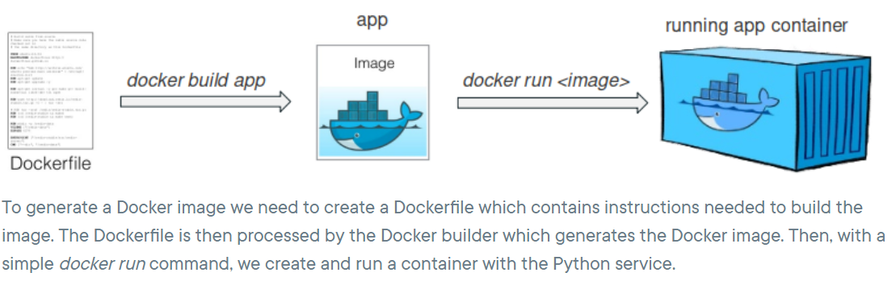
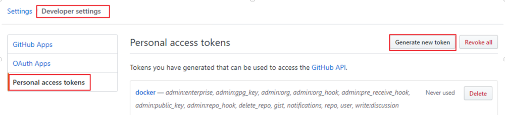
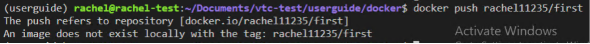
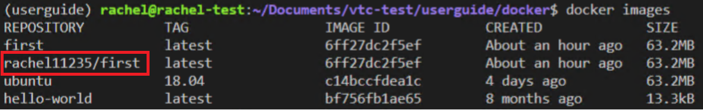

# Docker

What is dockerfile, image and container?
    

## Create DockerFile on workstation

## build command 

Build image conmmand:`docker build -t $name .`

List all image: `docker images`

Remove all images: `docker rmi $(docker images -aq)`

## Push DockerFile to Dockerhub or Github

* Get token from Github

    Get token from github first
        
    Docker login command: `docker login -u yu-rong-chen -p $token_id docker.pkg.github.com`

* Create repository on Docker Hub
    Log in Docker: `docker login ` and enter Docker Hub username and password
    Push to repository `docker push $Hub_username/$repository `

If docker push failed, you need to tag first
    

Command: `docker tag $ImageID $username/$repository`
    

## Choose project from Github to build 

## Build Commences

## Docker image get ready for the pull

## Docker Run

Start container command: 
`$docker run --name $ContainerName`

Start container and execute job command: 
`$docker run --name $ContainerName $ImageName robot test.robot`

Create a container and start a Bash session
`$docker run --name $ContainerName --rm -i -t $ImageName bash`

Try another command:

`$docker run -d -p 80:81 $ImageName `

`$docker exec -it $ContainerID /bin/bash`

Remove all containers: `docker rm $(docker ps -aq)`

## Run the container from the image on workstation